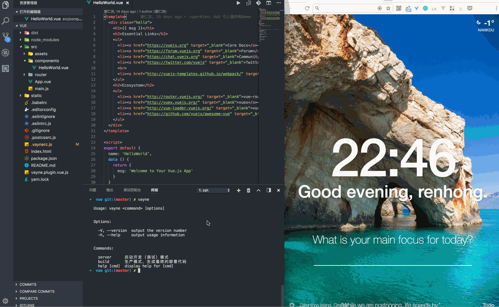

<p align="center"><a href="https://github.com/xierenyuan/vayne/" target="_blank"></a></p>
<h3 align="center">vayne</h3>
<p align="center">
  vayne 基于 vue-cli 的 webpack 全局安装的命令行工具, 全局安装依赖，可以省去每个项目安装开发依赖 的麻烦。同时以避免多个项目需同时维护多个webpack 配置的痛苦, 同时会同步vue-cli 的webpack 配置，当有新的配置时只需 升级vayne 即可享受。当然核心是无需在关心繁琐的webpack 配置。几分钟开始你的项目开发
</p>

[](https://www.npmjs.com/package/vayne)
[](https://nodejs.org/en/)

## 演示
<p align="center">
  
</p>

## Usage (使用)

```shell
# npm
npm i vayne -g
# yarn
yarn global add vayne
yarn add vayne -D --registry=https://registry.npm.taobao.org
```
### server (本地开发)

```shell
# 指定端口号
vayne server --prot=2000
```
### build （生成环境 打包）

``` shell
vayne build
# View the bundle analyzer report after build finishes
vayne build -R
```

## Like star (喜欢 请star 我😍）

## Documentation (文档)

* [documentation](https://vaynejs.github.io/) 文档看这里看这里

## Vayne Plugins(插件) [vayne](https://github.com/vaynejs)

* [vayne-plugin-vue](https://github.com/vaynejs/vayne-plugin-vue) 提供Vue 相关配置
* [vayne-plugin-angularjs](https://github.com/vaynejs/vayne-plugin-angularjs) 提供angularjs 相关配置 
* [vayne-plugin-stylelint](https://github.com/vaynejs/vayne-plugin-stylelint) stylelint 强验证 scss 

perset （预设）
* [stylelint-config-vayne](https://github.com/vaynejs/stylelint-config-vayne)
* [eslint-config-vayne](https://github.com/vaynejs/eslint-config-vayne)
* [babel-perset-vayne](https://github.com/vaynejs/babel-preset-vayne)

## Plan(计划)

- [ ] unit(引入了测试 但是keys 还没有编写)
- [x] 插件完善扩展 增加生命周期
- [x] 文档

## Examples (列子)
> 详见  __examples__  默认配置见 __lib/utils/vayne.config.js__ 

## 特性

### 自动重启
配置文件修改的修改会触发 vayne server的自动重启 会触发的文件有
* __.vaynerc__
* __.vaynerc.js__
* 或者 是vayne server --config 后边的文件

## 命令行参数

### vayne

```shell
$ vayne -h

  Usage: vayne <command> [options]


  Options:

    -V, --version  output the version number
    -h, --help     output usage information


  Commands:

    server      启动开发（调试）模式
    build       生产模式，生成最终的部署代码
    help [cmd]  display help for [cmd]
```

### vayne server
``` shell
$ vayne server -h
Usage: vayne server [options]

选项：
  -P, --port         服务端口号                                         [字符串]
  -H, --host         host                                               [字符串]
  -O, --openBrowser  是否打开浏览器                       [布尔] [默认值: false]
  -C, --config       指定配置文件                                       [字符串]
  -h                 显示帮助信息                                         [布尔]
```

### vayne build
``` shell
$ vayne build -h
Usage: vayne server [options]

选项：
  -R, --report  View the bundle analyzer report after build finishes
                                                          [布尔] [默认值: false]
  -C, --config  指定配置文件                                            [字符串]
  -h            显示帮助信息                                              [布尔]
```


## other
> 因为node-sass 安装过慢 所以在当前项目移除依赖 需在使用项目根路径手动安装 见

> 国内的小伙伴看这里 值像淘宝源
```shell
# npm 安装
SASS_BINARY_SITE=http://npm.taobao.org/mirrors/node-sass npm install node-sass -D

# yarn 指向淘宝镜像
yarn config set registry https://registry.npm.taobao.org -g

# yarn node-sass 安装
yarn config set sass_binary_site http://cdn.npm.taobao.org/dist/node-sass -g
```
